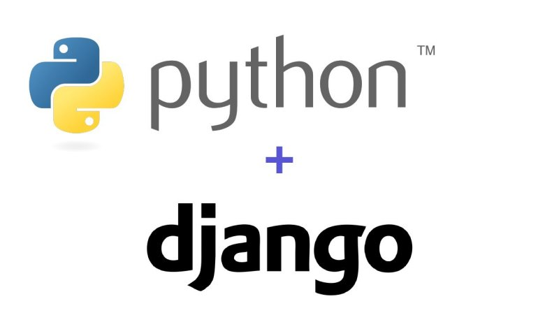
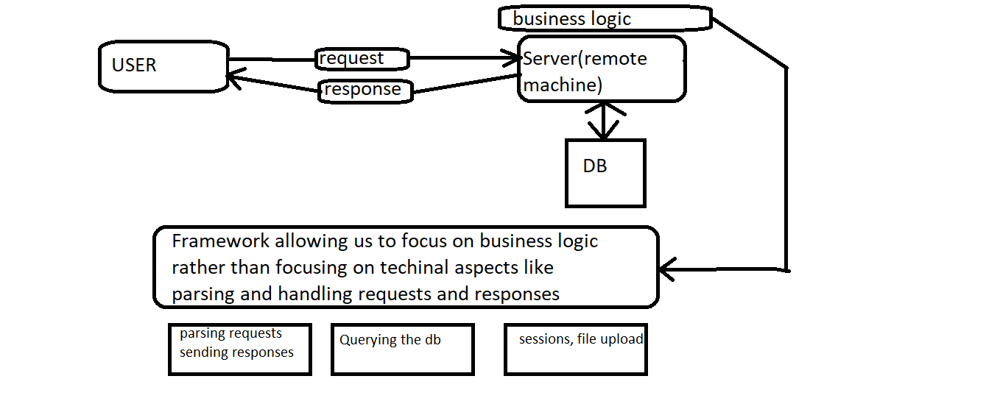

# What is Django ?
Django is a free, open-source, high-level Python web framework that facilitates rapid development and pragmatic & clean code. It was created to support web application development, web APIs, and web services. It utilizes the principles of MVC (Model-View-Controller) architecture and its primary aim is to ease the development of complex and database-driven websites. With the Django framework, web developers can focus on creating unique applications that are feature-rich, fast, secure, and scalable and benefit from greater flexibility than using a web development tool. Django takes care of a lot of hassles involved in web development, it enables users to focus on developing components needed for their application rather than spending time on already developed components

Due to the rising popularity of Python, Django has become a framework of choice for many Python development companies. But, why Django? Why is it so popular among developers for web development? Let’s figure out why so many developers around the world use it and how you can do the same.

##Benefits of using the Django framework
 
 
###Built with Python

Since the Django framework is built with Python, it inherits the key benefits of this programming language. It is considered to be quite easy to both use and read, and it’s ideal for machine learning. Python is really easy to learn, and it is usually the first language of choice for developers. Many tech giants including Google use Python in their tech stack extensively.

###Batteries of Django

Django is popular for “batteries included” which means developers can find almost everything to develop a full-fledged application. These batteries include ORM, Authentication, session management support, HTML templating, URL routing, Middlewares, HTTP libraries, Multi-site support, template engine, forms, view layers, model layers, Python compatibility, and more. This aspect speeds up the development as developers simply don’t need to implement this basic stuff.

###Highly Secure

Django doesn't compromise with security and offers by default features to help protect your application and your users. It helps developers avoid many common security mistakes by providing a framework that has been engineered to do the right things to protect the website automatically. Django is usually the first one to respond to vulnerabilities and alert other frameworks.

###Highly Scalable & Reliable

Obviously, you need a framework that can handle a huge amount of data and traffic on your application. Django enables any application to handle any audience volume growth with efficiency. It includes a series of default components that can be unplugged and replaced for more specific solutions. As Django is a very popular and widely used web application framework across the industries, a lot of cloud service providers are taking all measures to deploy the application fast and easily on their platforms. This makes it easy for developers to develop more functional, reliable, and efficient applications.

###DRY Principle

The DRY (don’t repeat yourself) principle encourages developers to not only use the existing code but also avoid unnecessary lines of code, bugs, or errors in the application. This makes Django time-efficient, perfect for high-load systems, and also simplifies maintenance.

###Great Set of libraries

Another great advantage inheriting from Python and its wonderful community is that Django has numerous useful libraries. Some of the most popular ones include the Django REST framework for building APIs (Application Programming Interfaces) and the CMS focused framework for website content management.

###Excellent Community & Documentation

Django is supported by a large and active community of developers who help you solve issues you may encounter at development. There is also a massive amount of material and resources available right from documentation, tutorials, blogs to meetups and workshops.

# Why Django?
