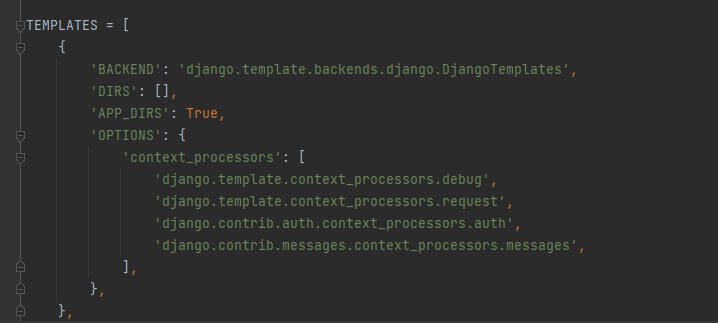

This project is all intended for learning django by making
a project.The file django.md will give you a brief intro about it 
and as you go through the projects you may learn different 
concepts.

### Django Installation 
``python -m pip install Django``

or you can follow the link to know more : 
<a href="https://docs.djangoproject.com/en/3.2/topics/install/">Click Here</a>

### Start Project 
Type the following command in the terminal for starting
a project.
``django-admin startproject <project_name>`` \
This command will create a folder with project name 
having one file **manage.py** anf folder with same **project_name**
with some file's init. Each file contains its own
description of what it is used for.

These two things inside projects will never be sufficient 
for completing project every website will have some 
modules/pages which indeed also called as apps in django 
, so for creating these apps we need to use django command-line 
file manage.py and run the following command for creating our app

``python manage.py startapp <app_name>``

### About Files
Here comes the first important file in our app that is
**views.py** and **urls.py** that's where we register 
and define the urls and their purpose or work after calling 
them.With urls you can register urls in app and with 
views(just a python function) you can define working of that urls in that app.

So Once after installing apps we can have some url
paths specific to each app that can be connected to 
global routes after completing them . In the similar way 
we should also connect sub apps to our main apps 
using **setting.py** file

As we can't show response as a plain text we need html 
to show some formatted output that's where we use concept called templates
that allow us to predefine html files which then we can 
enrich with dynamic data with the help of python code.

#### What should we do to add templates and why we should add?

see as there is templates in settings.py when we run the server 
it will search for templates folder in apps directory
so our first step is to create ``templates`` folder 
inside our app folder.

So there comes question why we made another folder with same name as app?
because, our app bundles entire templates into single directory
before outputting on browser , so to not conflict between 
apps output formatting we made a sub-directory.

Even if we add html we may still need to format it using css and 
js to look it nicer and make the page dynamic, and these two 
css and js can't be influenced by python, so they are 
statically written and here comes the folder ``static`` inside 
our app folder to specify our server these are css and js files.

## What is data ?

Above diagram illustrates how data is being distributed 
in the website. Also you should have observed a file
`db.sqlite3` which is the db file , one added advantage in django is 
you need not have to know sql to work with it instead we 
write db models in `models.py` which indeed are nothing but python 
classes. Each model is a table in db that is being
automatically created by django.

So now you have created some models , to create those
models in db we need to run few commands using the 
django command line file `manage.py` \
``python manage.py makemigrations`` \
migrations are db instructions , by running this command
you generate instructions to db , So once after generating 
instructions you should ask the db to follow instructions
to make table so to do that run the following command. \
``python manage.py migrate`` \
One thing we need to keep in mind that every time you create 
a new model or modify the existing one you need to 
generate and execute instructions to get modified in db.

When we work with data we might need some relationship
between different data in-sense different tables that we are using 
in our project they are : \

#### Managing Data
So once after creating the data in the db at least there 
must be one admin who should have access to modify data 
for that we can use the django provided built-in 
admin panel which can only be accessed to website creator
.For that we need a superuser that must be created , to create 
a superuser enter the following command in terminal \
``python manage.py createsuperuser`` \
and follow the instructions and enter the prompted things 
on terminal.

### Managing Images
With django we can manage images very simply because our 
django does the heavy lifting behind the scenes we just need 
to provide the path for which it has been saved on the db 
- At the very same time we should also provide some additional 
settings to the `settings.py`  file to add *media_root* and 
*media_url* to identify where the images have to be retrieved
from the storage.
- It's very simple right but there is another step we need 
take care of that is installing `pillow` package bcs
django works with image using image manipulating pillow 
package. To install type the following in command line. \
``python -m pip install Pillow`` \
We now had taken care of image upload part but there is
still need of showing those images on the server or serving
them statically that's where we need to configure our 
`urls.py` file to server the static paths including the
dynamic slugs.

### Managing Forms
In Django everything you need will have some or other 
pre-built backend lifting for what we have written in similar
way we can manage forms using existing models and call
them using views, which doesn't mean that you can also 
do forms using html `form` tag also and validations and
other lifting does by the django. \
For more info visit <a href="https://docs.djangoproject.com/en/3.2/topics/forms/">here</a>

### Managing Admin 
As we had created a superuser to create all our meetups
or simply to manage our db with built in dashboard 
but it may not the same UI you are preferring for your 
application where you can customize admin panel according
to your wish, which alone a very wide topic which can be explored 
using the following link. \
<a href="https://docs.djangoproject.com/en/3.2/ref/contrib/admin/">Click Here for Django Admin Docs</a>

### Running Server
``python manage.py runserver``